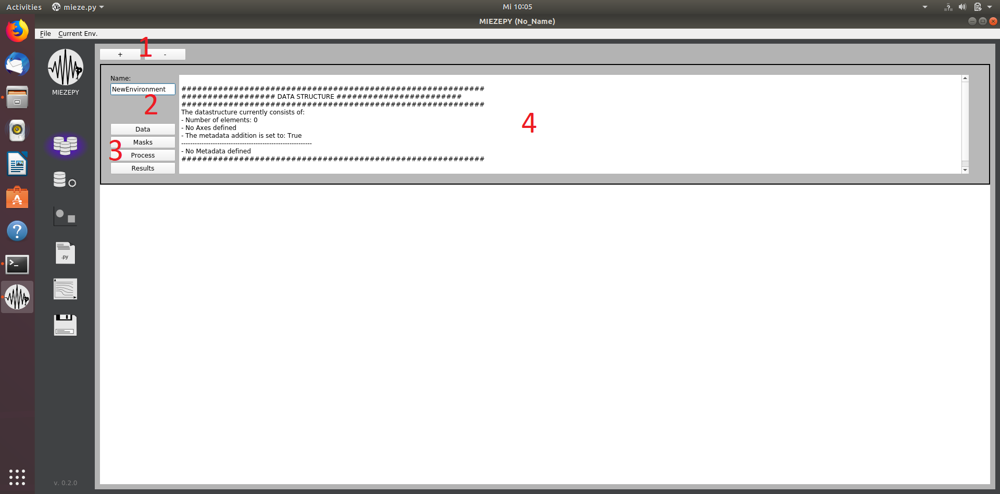
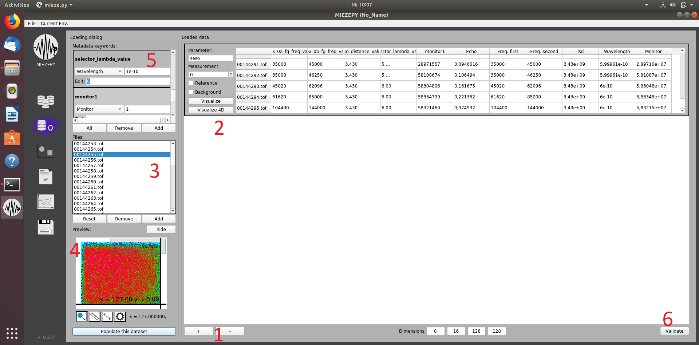
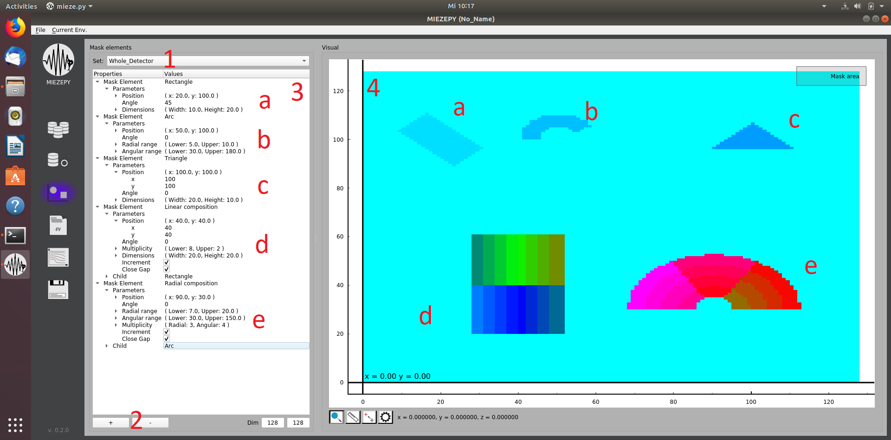
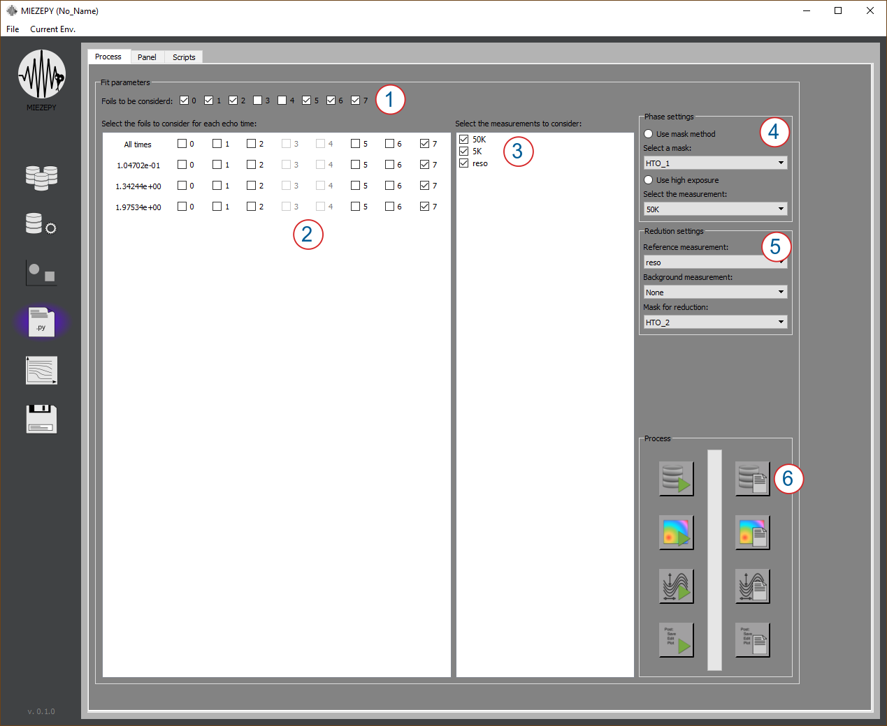
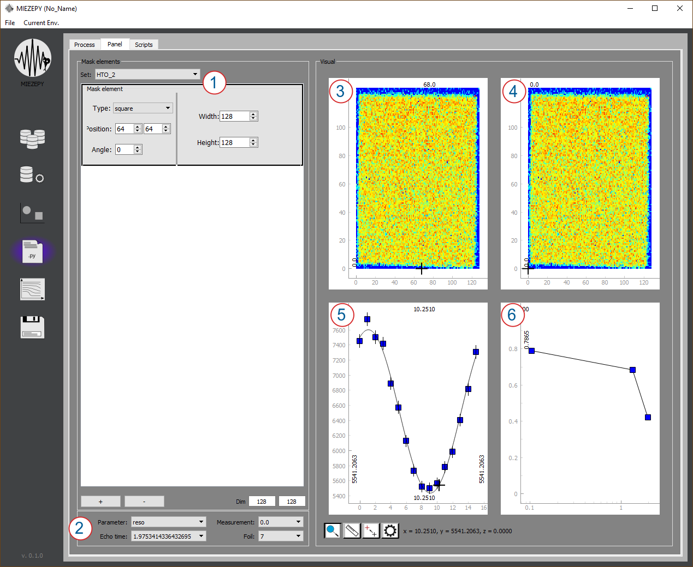
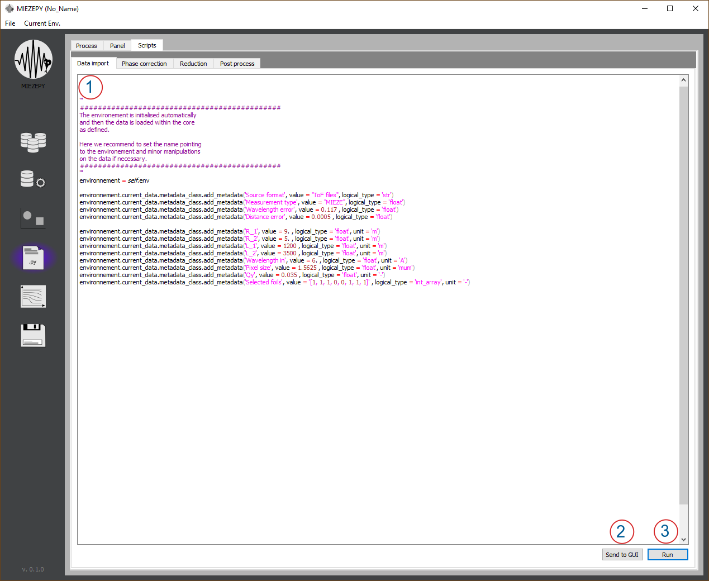

### How-To

<!DOCTYPE html>
<html lang="en">
<head>
    <meta charset="UTF-8">
    <meta name="viewport" content="width=device-width, initial-scale=1.0">
    <title>MIEZEPY Installation and Usage Guide</title>
</head>
<body>

<h2>Starting the Program</h2>

Right now, there is only the option to start the program via the command line. Open your command line, for example, the Anaconda-Bash. Activate your python3 environment:

<pre>
<code>activate py37</code>
</pre>

Run Python and execute:

<pre>
<code>
from miezepy.mieze import Mieze
Mieze(True)
</code>
</pre>

After the GUI starts, you can choose between the following pages, which are arranged in the order of their typical usage during data reduction: environment handling, data loading, mask creation, data reduction, result plotting, saving, and loading sessions.

<h3>Environments</h3>

The first page allows creating and organizing the environments, which are currently opened. The current environment is highlighted and can be seen in brackets after MIEZEPY in the title of the program window. The +/- Buttons (1) allow creating and removing the environments. A proper name (2) should be selected. All the following pages can also be directly accessed through the corresponding buttons (3).

<figure>
    
    <figcaption>The Environment tab: 1: create a new environment 2: name selection 3: switch to the other tabs (data import, mask creation, data reduction, and results) 4: overview of the environment parameters</figcaption>
</figure>

<h3>Data Import</h3>

The import of .TOF files, which are provided by the NICOS instrument control software is handled on this page. The GUI is shown in Fig. <a href="#fig:data_import">data_import</a>. Again, with the +/- key (1), a new dataset can be added or removed. All datasets of this environment are listed in (2). Every dataset contains the following information:

<ul>
    <li><strong>Parameter:</strong> Name your dataset to describe the investigated parameter in an appropriate manner.</li>
    <li><strong>Measurement:</strong> If you have measured the same parameter (Q, T, B ...) several times, you may want to specify that by giving it different numbers.</li>
    <li><strong>Reference:</strong> Select if this dataset is your reference/resolution measurement.</li>
    <li><strong>Background:</strong> Select if this dataset is your background measurement.</li>
    <li><strong>Visualize (4D):</strong> Visualize the detector images of the various foils and time channels in the dataset.</li>
    <li>The table summarizes all the metadata of the different TOF files. One TOF file is measured at a specific set of first frequency, second frequency, sample-detector distance (LSD), and wavelength. (Additionally, the metadata contain the monitor counts, proportional to the current neutron flux). Therefore, one TOF file corresponds to one row, where the "Echo" (short for spin echo time) is calculated from these four parameters. The "Echo" therefore serves as an index for matching same conditions from different datasets later on). For each TOF-file:
        <ul>
            <li><strong>cbox_0a_fg_freq_value:</strong> frequency of the first resonant flipper as read from the TOF file</li>
            <li><strong>cbox_0b_fg_freq_value:</strong> frequency of the second resonant flipper as read from the TOF file</li>
            <li><strong>psd_distance_value:</strong> sample-detector distance as read from the TOF file</li>
            <li><strong>selector_lambda_value:</strong> wavelength as read from the TOF file</li>
            <li><strong>monitor1:</strong> monitor counts as read from the TOF file</li>
            <li><strong>Echo:</strong> Mieze time / spin echo time, as calculated from the following four parameters:
                <ul>
                    <li><strong>Freq. First:</strong> manipulated value of the first frequency for calculation</li>
                    <li><strong>Freq. Second:</strong> manipulated value of the second frequency for calculation</li>
                    <li><strong>lsd:</strong> manipulated value of the sample-detector distance for calculation</li>
                    <li><strong>Wavelength:</strong> manipulated value of the wavelength for calculation</li>
                    <li><strong>Monitor:</strong> manipulated monitor counts</li>
                </ul>
            </li>
        </ul>
    </li>
</ul>

A list of the .TOF files belonging to one dataset can be selected under "Files" (3). The current TOF file is visualized in (4) to check your selection before loading. With the "Populate this dataset" button, the data from the selected TOF file, as well as the manipulations to the metadata, can be loaded into the selected dataset. The metadata can be manipulated by writing values in the lines (Fig. <a href="#fig:data_import">data_import</a>~5).

<ul>
    <li>A single value will overwrite ALL entries for this metadata for this dataset.</li>
    <li>A comma-separated list can be used to change each entry separately (in the order they appear in the table). A comma-separated list, which is shorter than the number of entries, will only change the entries covered by the list - remaining entries are not changed.</li>
</ul>

Note: This will NOT overwrite the .TOF files. Thus, your original data remains the same.

<figure>
    
    <figcaption>The Data Import tab: 1: create a new dataset 2: List of datasets with their information 3: TOF files to be imported into an environment 4: visualization of the integrated intensity in the selected TOF file 5: manipulation of the metadata of the selected dataset 6: validate - checks if input is valid and loads it into the environment.</figcaption>
</figure>

<h3>Masks</h3>

An integral part of every data reduction is to select where the interesting signal appears on the position-sensitive detector.

<figure>
    
    <figcaption>The Mask Creation tab: 1: selection of the current mask, when "New..." is selected, you can type the new name in here and confirm with the "Enter" key. 2: Add a new shape to the current mask. 3: Manipulate the shapes within this mask. 4: Visualization of the current shapes.</figcaption>
</figure>

<h3>Data Reduction</h3>
<figure>
    
    <figcaption>Caption</figcaption>
</figure>
<figure>
    
    <figcaption>Caption</figcaption>
</figure>
<figure>
    
    <figcaption>Caption</figcaption>
</figure>

<h3>Plotting</h3>

<h3>Save/Load</h3>

<h2>Work-flow</h2>

<h3>Organize Your Data</h3>

At first, you need to organize your data, so that the data import is simple. Typically you want to sort by sample, wavelength, momentum transfer, temperature, and magnetic field. 
After this preliminary work, you can open MIEZEPY by opening the shell/Anaconda Prompt and typing:

<pre>
<code>
python -m miezepy.mieze
</code>
</pre>

Create an environment.

<h3>Import Data</h3>

Now you want to fill the environment with the suitable data. Go to the data import tab and create a new dataset, typically the resolution measurement. Fill it with the corresponding data, which you have sorted in the first step. Go through the table and identify any .TOF files, where wrong metadata were loaded (A typical example would be, that the wavelength is 5.997 instead of 6, due to rounding issues in the data creation). You can then adjust such errors within the metadata window, as explained earlier.

</body>
</html>

