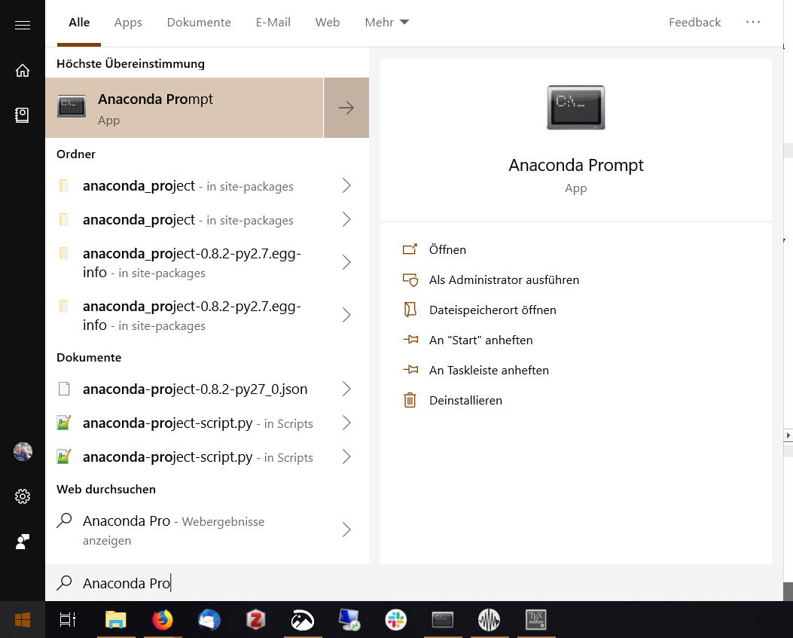

<html lang="en">
<head>
    <meta charset="UTF-8">
    <meta name="viewport" content="width=device-width, initial-scale=1.0">
    <title>MIEZEPY Installation Guide</title>
</head>
<body>

<h1>Installation Guide for MIEZEPY</h1>

<h2>Windows Installation</h2>

Since the program is based on Python, it also works under Windows, with different aspects having to be considered:

<h3>Preparations</h3>

It is recommended to install Python via the Anaconda package. A Win10 version can be found here: <a href="https://www.anaconda.com/download/#windows">https://www.anaconda.com/download/#windows</a>. After you have installed Anaconda, we recommend creating a separate environment within Anaconda solely for MIEZEPY. This ensures that all packages for MIEZEPY are kept together and no dependencies are overwritten when installing other Python software. The full instructions for environments can be found here: <a href="https://conda.io/docs/user-guide/tasks/manage-environments.html">https://conda.io/docs/user-guide/tasks/manage-environments.html</a>.

To create an environment, open the Anaconda Prompt, which is also the recommended command line on Windows for interacting with Anaconda/Python.

<figure>
    
    <figcaption>Caption</figcaption>
</figure>

A new environment named "miezepy", with Python 3.7 and the required modules can be created with the command:

<pre>
<code>
conda create --name miezepy python==3.7
</code>
</pre>

Afterwards, update pip and install the most recent version of setuptools:

<pre>
<code>
python -m pip install -U pip setuptools
</code>
</pre>

Additionally, the installation of the PyQt5 package requires the installation of C++ compiler tools, e.g., via Visual Studio. On Windows 10, open Visual Studio and select modify.

<h3>Installing the Software</h3>

The GitHub repository of the MIEZEPY project can be downloaded here: <a href="https://github.com/RESEDA-MLZ/MIEZEPY">https://github.com/RESEDA-MLZ/MIEZEPY</a>. (Ideally, the git repository can also be cloned, if you are familiar with git.) As the download is completed, the user is required to unzip the .zip content and open a terminal window in the downloaded folder. This can be done by either right-clicking on an empty field within the folder and selecting "Open terminal" or by directly entering:

<pre>
<code>
cd Path/to/folder
</code>
</pre>

in an already opened terminal window.

</body>
</html>

